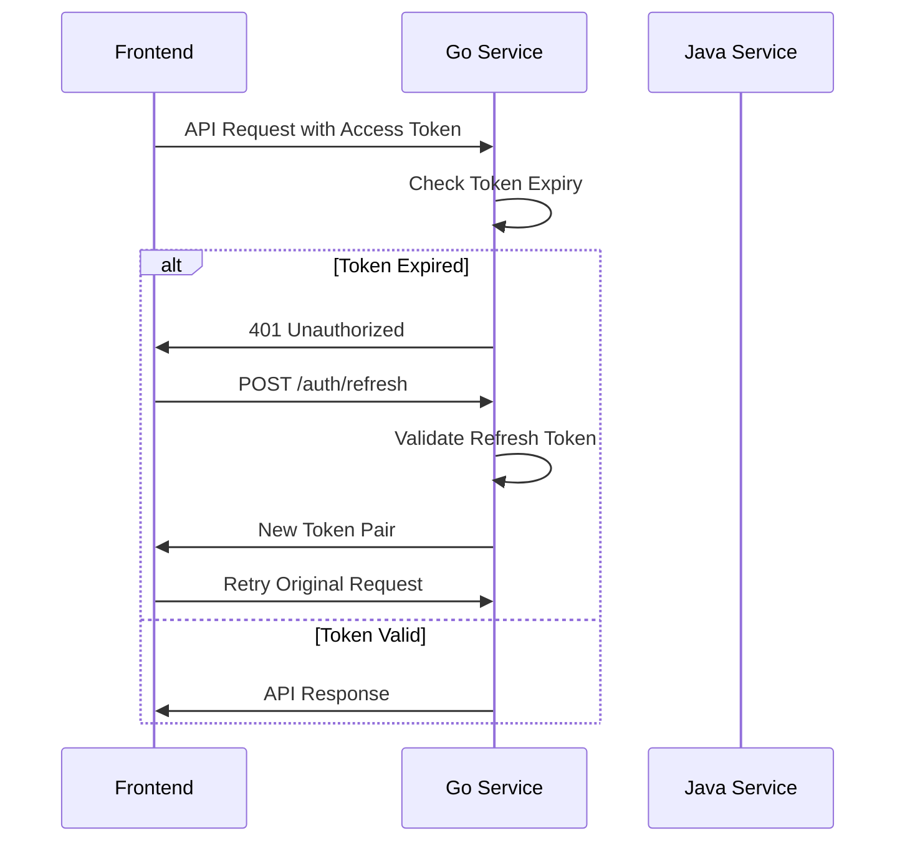

# JWT Implementation Guide

## 🔐 **Complete JWT Authentication System**

This document outlines the comprehensive JWT implementation for the Gruvit music platform, including backend services, frontend integration, and security features.

## 🏗️ **Architecture Overview**

```
Frontend (Next.js) ←→ Go Music Service ←→ Java Auth Service
     ↓                      ↓                    ↓
JWT Manager          JWT Service         JWT Validation
     ↓                      ↓                    ↓
localStorage         Token Generation    Token Validation
```

## 📁 **Files Created/Updated**

### **Backend (Go Service)**
- ✅ `server/go/services/jwt_service.go` - Core JWT service
- ✅ `server/go/handlers/auth.go` - Authentication handlers
- ✅ `server/go/middleware/auth.go` - Updated JWT middleware
- ✅ `server/go/models/track.go` - Added User model
- ✅ `server/go/main.go` - Integrated JWT service and routes
- ✅ `server/go/test_jwt.go` - JWT testing utility

### **Frontend (Next.js)**
- ✅ `client/src/lib/jwt.ts` - JWT utility functions
- ✅ `client/src/contexts/AuthContext.tsx` - React authentication context

### **Configuration**
- ✅ `server/go/config.dev.env` - Updated JWT secret
- ✅ `k8s/secrets.yaml` - Updated JWT secret (base64 encoded)
- ✅ `k8s/configmap.yaml` - Added JWT configuration
- ✅ `k8s/go-service-deployment.yaml` - Added JWT environment variables

## 🔧 **JWT Service Features**

### **Token Types**
1. **Access Token** - 24 hours expiry, contains user info
2. **Refresh Token** - 7 days expiry, for token renewal

### **Token Claims**
```json
{
  "user_id": "user_123",
  "username": "john_doe",
  "email": "john@example.com",
  "role": "user",
  "iss": "gruvit-auth-service",
  "sub": "user_123",
  "aud": ["gruvit-music-service"],
  "exp": 1640995200,
  "iat": 1640908800,
  "nbf": 1640908800
}
```

### **Security Features**
- ✅ **Token Blacklisting** - Revoke tokens on logout
- ✅ **Token Validation** - Comprehensive validation with issuer/audience checks
- ✅ **Automatic Refresh** - Seamless token renewal
- ✅ **Rate Limiting** - Protect against brute force attacks
- ✅ **CORS Support** - Secure cross-origin requests

## 🚀 **API Endpoints**

### **Authentication Endpoints (Public)**
```http
POST /auth/register
POST /auth/login
POST /auth/refresh
POST /auth/logout
GET  /auth/validate
```

### **Protected Endpoints (Require JWT)**
```http
GET  /api/profile
PUT  /api/profile
GET  /api/stream/:trackId
GET  /api/playlists
POST /api/playlists
PUT  /api/playlists/:id
DELETE /api/playlists/:id
```

## 🧪 **Testing the JWT Implementation**

### **1. Test JWT Service**
```bash
cd server/go
go run test_jwt.go
```

### **2. Test Authentication Endpoints**
```bash
# Register a new user
curl -X POST http://localhost:8080/auth/register \
  -H "Content-Type: application/json" \
  -d '{
    "username": "testuser",
    "email": "test@example.com",
    "password": "password123"
  }'

# Login
curl -X POST http://localhost:8080/auth/login \
  -H "Content-Type: application/json" \
  -d '{
    "username": "testuser",
    "password": "password123"
  }'

# Validate token
curl -X GET http://localhost:8080/auth/validate \
  -H "Authorization: Bearer YOUR_ACCESS_TOKEN"

# Get user profile
curl -X GET http://localhost:8080/api/profile \
  -H "Authorization: Bearer YOUR_ACCESS_TOKEN"
```

### **3. Test Frontend Integration**
```typescript
import { jwtManager } from '@/lib/jwt';

// Login
const response = await jwtManager.login('username', 'password');

// Make authenticated request
const data = await jwtManager.makeAuthenticatedRequest('/api/profile');

// Logout
await jwtManager.logout();
```

## 🔒 **Security Configuration**

### **JWT Secret**
```bash
# Development
JWT_SECRET=gruvit-super-secret-jwt-key-change-this-in-production-2024

# Production (Base64 encoded)
JWT_SECRET=Z3J1dml0LXN1cGVyLXNlY3JldC1qd3Qta2V5LWNoYW5nZS10aGlzLWluLXByb2R1Y3Rpb24tMjAyNA==
```

### **Token Expiry**
- **Access Token**: 24 hours (86400 seconds)
- **Refresh Token**: 7 days (604800 seconds)

### **Rate Limiting**
- **Auth Endpoints**: 10 requests/minute per IP
- **Protected Endpoints**: Varies by endpoint

## 📱 **Frontend Integration**

### **1. Setup Auth Provider**
```tsx
// app/layout.tsx
import { AuthProvider } from '@/contexts/AuthContext';

export default function RootLayout({ children }) {
  return (
    <html>
      <body>
        <AuthProvider>
          {children}
        </AuthProvider>
      </body>
    </html>
  );
}
```

### **2. Use Authentication**
```tsx
// components/LoginForm.tsx
import { useAuth } from '@/contexts/AuthContext';

export function LoginForm() {
  const { login, loading, error } = useAuth();

  const handleSubmit = async (e) => {
    e.preventDefault();
    try {
      await login(username, password);
      router.push('/dashboard');
    } catch (err) {
      console.error('Login failed:', err);
    }
  };

  return (
    <form onSubmit={handleSubmit}>
      {/* Form fields */}
    </form>
  );
}
```

### **3. Protected Routes**
```tsx
// components/ProtectedComponent.tsx
import { withAuth } from '@/contexts/AuthContext';

function Dashboard() {
  const { user, logout } = useAuth();
  
  return (
    <div>
      <h1>Welcome, {user?.username}!</h1>
      <button onClick={logout}>Logout</button>
    </div>
  );
}

export default withAuth(Dashboard);
```

## 🔄 **Token Refresh Flow**



## 🛡️ **Security Best Practices**

### **1. Token Storage**
- ✅ **localStorage** for web applications
- ✅ **Secure HTTP-only cookies** for enhanced security
- ✅ **Automatic cleanup** on logout

### **2. Token Validation**
- ✅ **Signature verification**
- ✅ **Expiry checking**
- ✅ **Issuer/audience validation**
- ✅ **Blacklist checking**

### **3. Error Handling**
- ✅ **Graceful token refresh**
- ✅ **Automatic logout on failure**
- ✅ **User-friendly error messages**

## 🚀 **Deployment**

### **Local Development**
```bash
# Start Go service
cd server/go
go run main.go

# Test JWT
go run test_jwt.go
```

### **Docker Deployment**
```bash
# Set JWT secret
export JWT_SECRET=gruvit-super-secret-jwt-key-change-this-in-production-2024

# Start services
docker-compose up -d
```

### **Kubernetes Deployment**
```bash
# Apply configurations
kubectl apply -f k8s/secrets.yaml
kubectl apply -f k8s/go-service-deployment.yaml

# Verify deployment
kubectl get pods -n gruvit
```

## 📊 **Monitoring & Analytics**

### **Health Checks**
```bash
# Check JWT service health
curl http://localhost:8080/health

# Validate token
curl -X GET http://localhost:8080/auth/validate \
  -H "Authorization: Bearer YOUR_TOKEN"
```

### **Logs**
```bash
# View JWT-related logs
docker-compose logs go-service | grep -i jwt

# Kubernetes logs
kubectl logs -l app=go-music-service -n gruvit | grep -i jwt
```

## 🔧 **Configuration Options**

### **Environment Variables**
```bash
# JWT Configuration
JWT_SECRET=your-secret-key
JWT_EXPIRATION=86400
JWT_REFRESH_EXPIRATION=604800

# Rate Limiting
RATE_LIMIT_AUTH=10

# CORS
CORS_ORIGINS=http://localhost:3000,https://gruvit.com
```

### **Customization**
- **Token Expiry**: Modify in `jwt_service.go`
- **Claims**: Add custom claims in `Claims` struct
- **Validation**: Extend validation logic in middleware
- **Storage**: Implement Redis blacklist for production

## 🎯 **Next Steps**

1. **Database Integration**: Connect to user database
2. **Password Hashing**: Implement bcrypt for passwords
3. **Email Verification**: Add email verification flow
4. **Two-Factor Auth**: Implement 2FA for enhanced security
5. **Social Login**: Add OAuth providers (Google, GitHub)
6. **Audit Logging**: Track authentication events

## 🐛 **Troubleshooting**

### **Common Issues**

1. **Token Validation Failed**
   - Check JWT secret matches between services
   - Verify token format and expiry
   - Check issuer/audience claims

2. **Refresh Token Failed**
   - Ensure refresh token is not expired
   - Check token blacklist
   - Verify user still exists

3. **CORS Issues**
   - Update CORS configuration
   - Check frontend URL in allowed origins
   - Verify preflight requests

### **Debug Commands**
```bash
# Test JWT generation
go run test_jwt.go

# Check token structure
echo "YOUR_TOKEN" | base64 -d

# Validate token manually
curl -X GET http://localhost:8080/auth/validate \
  -H "Authorization: Bearer YOUR_TOKEN"
```

Your Gruvit platform now has a complete, production-ready JWT authentication system! 🎉
